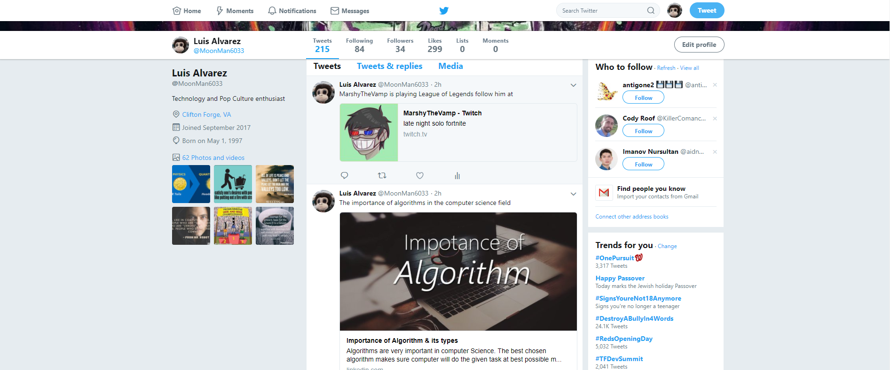

# Micro.Bot

This project is a free marketing tool that you can use to schedule posts through social media networks. Currently the main one in use is Twitter.

## Getting Started

These instructions will get you a copy of the project up and running on your local machine for development and testing purposes. See deployment for notes on how to deploy the project on a live system.

Use git and clone this project with the link below to the location you want your bot to be

``
https://github.com/TheGameFreak720/Micro.bot.git
``

### Prerequisites

You will need a few things in your local machine to get this project running smoothly.

- [Nodejs](https://nodejs.org/en/) = Node.js (Node) is an open source development platform for executing JavaScript code server-side.
    - This video can help you set up Node easily and understand the code: https://www.youtube.com/watch?v=U8XF6AFGqlc
    
- [Git](https://git-scm.com/) = is a version control system for tracking changes in computer files and coordinating work on those files among multiple people. It is primarily used for source code management in software development, but it can be used to keep track of changes in any set of files.
    - This video series can help you gain an understanding on what is git, how to install it and use it: https://www.youtube.com/playlist?list=PLqGj3iMvMa4LFz8DZ0t-89twnelpT4Ilw
    
- [Mongodb](https://www.mongodb.com/) = is a cross-platform and open-source document-oriented database, a kind of NoSQL database. As a NoSQL database, MongoDB shuns the relational database's table-based structure to adapt JSON-like documents that have dynamic schemas which it calls BSON.
    - You can watch this video to learn how to use mongodb and set everything up: https://www.youtube.com/watch?v=pWbMrx5rVBE&t=11s 
      
### Installing

A step by step series of examples that tell you have to get a development env running

Run this command on the directory where you have the bot located. It should install all the dependencies for the project.

```
npm install
```

Then create a config folder on the root of the project and it should look like so

- config (folder)
- Models (folder)
    - article.js
    - video.js
- node_modules (folder)
    - Whatever dependencies you installed
- public
    - READMEpics
- .gitignore
- bot.js
- package.json
- README.md
- yarn.lock

Now there are a few files that are not included for security reasons and are under the config folder

- config
    - database.js
    - twit.js
    - twitch.js
    
Now each file will be similar and contain some data to connect to your database, to your twitch and tweeter account.

- database.js
```
module.exports = {
    database: 'Include here the link to your mongodb',
    secret: 'yoursecret'
};
```

- twit.js
```
module.exports = {
        consumerKey: 'add here consumer key',
        consumerSecret: 'add here consumer secret',
        accessToken: 'add here the access token',
        accessSecret: 'add here the acess secret'
};
```
You can get all this info in this link here https://apps.twitter.com/

- twitch.js
```
module.exports = {
    twitchClientId: 'add here the client id'
};
```
You can get access to the Twitch API in this link here: https://dev.twitch.tv/

Now if you look at the models both the article and video schema is set up to have a body and a link. You can make your 
own schemas if you want a more personalized post. The video schema is the one I use for youtube video post. The article
schema is used for guides, reviews, websites, wikis, etc.

The db I use have 2 collections articles and videos. Each document regardless of the collection has this set up
```
{
    "body": "Somethings you need to know before trading bitcoins",
    "link": "https://bitcoin.org/en/you-need-to-know"
}
```

Make sure you add those 2 collections in plural and set up the database.js url right so you can get info from your db
and add some files using the structure above so the bot can get some information out of the db nicely.

A few tips

- Your db doesn't have to be local but for testing purposes I would try to run it first on my machine
- I would try to run the tweets first on the console before attempting to make a post on twitter. You can comment out 
the section I commented out below so you can get those results
```
const articlePost = schedule.scheduleJob({hour: 17, minute: 0}, function(){
    Article.find( function (err, article) {
        if (err) {
            console.log(err);
        } else {
            let tweet = {
                status: article[0].body + '\n \n' + article[0].link
            };

            console.log(tweet.status);
            //T.post('statuses/update', tweet, function (err, data, response) {
                //if(err) {
                    //console.log(err);
                //}
            //});
            article[0].remove();
        }
    });
});
```

- The twitch post is optional but it's a good example in case you want to use a different API to get some data and post 
in twitter. 

This should be the end result



## Deployment

I used DigitalOcean to deploy this application on the web but you can use your local machine, any online service that 
you can use node or a raspberry pi since they are small, cheap and easy to mantain. All you need to do is upload your 
code to GitHub, Bitbucket, Gitlab, etc and just follow the same steps for installing the dependencies.

## Built With

* [Nodejs](https://nodejs.org/en/) - Web framework for the server side
* [Yarn](https://yarnpkg.com/en/) - Dependency Management
* Various packages that you can find on the package.json

## Contributing

Please read [CONTRIBUTING.md](CONTRIBUTING.md) for details on our code of conduct, and the process for submitting pull requests to us.

## Authors

* **Luis Alvarez** - *Initial work* - [TheGameFreak720](https://github.com/TheGameFreak720)

## License

This project is licensed under the Apache License 2.0 - see the [LICENSE.md](LICENSE.md) file for details

## Acknowledgments

* Hat tip to anyone who's code was used
* To my friend Josh who gave me a bit more to do with the bot

